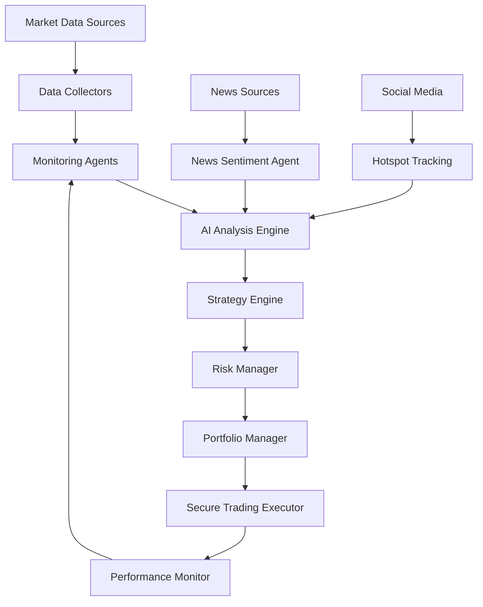

# NyxTrade Project Architecture & Integration Guide

## 🏗️ Complete System Architecture

```
NyxTrade/
├── 🤖 Core AI Agents System
│   ├── agents/                          # Specialized AI agents
│   │   ├── arbitrage_hunter/            # Cross-exchange arbitrage
│   │   ├── market_analyzer/             # Market analysis & prediction
│   │   ├── news_sentiment/              # News sentiment analysis
│   │   ├── portfolio_manager/           # Portfolio optimization
│   │   └── risk_manager/                # Risk assessment & control
│   │
├── 📊 Strategy Engine
│   ├── strategy_engine/
│   │   ├── core/                        # Strategy framework
│   │   ├── ai_interface/                # AI agent integration
│   │   ├── monitoring/                  # Strategy performance tracking
│   │   ├── examples/                    # Sample strategies
│   │   └── jesse_integration/           # Jesse framework support
│   │
├── 🔍 Monitoring Agents
│   ├── monitoring_agents/
│   │   ├── agents/                      # Market monitoring agents
│   │   │   ├── market_regression/       # BTC/ETH mean reversion
│   │   │   ├── trend_tracking/          # Trend analysis
│   │   │   ├── fund_flow/               # Capital flow monitoring
│   │   │   ├── indicator_collector/     # Technical indicators
│   │   │   └── hotspot_tracking/        # Social/news trends
│   │   ├── core/                        # Monitoring infrastructure
│   │   └── gemini_integration/          # Google Gemini AI
│   │
├── 🔒 Security & Trading
│   ├── trading/                         # Secure trading execution
│   ├── utils/secure_wallet.py           # Hardware wallet integration
│   └── utils/a2a_coordinator.py         # Agent-to-agent coordination
│   │
├── 🗄️ Data & Infrastructure
│   ├── data/collectors/                 # Market data collection
│   ├── utils/database.py                # Database management
│   ├── utils/logger.py                  # Logging system
│   └── config/                          # Configuration management
│   │
└── 🧪 Testing & Examples
    ├── tests/                           # Comprehensive tests
    ├── examples/                        # Integration demos
    └── scripts/                         # Utility scripts
```

## 🔄 Module Integration & Data Flow

### 1. Core Data Flow Architecture



### 2. Agent Coordination System

```python
# Central coordination hub
from utils.a2a_coordinator import AgentCoordinator

coordinator = AgentCoordinator()

# Register all agents
coordinator.register_agent("market_analyzer", market_analyzer_agent)
coordinator.register_agent("risk_manager", risk_manager_agent)
coordinator.register_agent("portfolio_manager", portfolio_manager_agent)

# Agents communicate through coordinator
market_signal = await coordinator.send_message(
    from_agent="market_analyzer",
    to_agent="portfolio_manager", 
    message_type="market_opportunity",
    data={"symbol": "BTC", "signal": "buy", "confidence": 0.85}
)
```

### 3. Strategy Engine Integration

```python
# Strategy engine receives signals from monitoring agents
from strategy_engine.ai_interface import AgentStrategyManager
from monitoring_agents.agents.market_regression import BTCETHRegressionAgent

# Create integrated system
strategy_manager = AgentStrategyManager()
market_monitor = BTCETHRegressionAgent()

# Monitor provides signals to strategy engine
market_result = await market_monitor.run_analysis_cycle()
if market_result.analysis['regression_opportunities']:
    # Create strategy based on monitoring signal
    strategy_id = strategy_manager.create_strategy_instance(
        "MovingAverage", "Regression_Strategy", "BTCUSDT"
    )
```

## 🤖 AI Agent Ecosystem

### Core AI Agents

#### 1. Market Analyzer Agent
```python
# Location: agents/market_analyzer/
# Purpose: Comprehensive market analysis and prediction
# Integration: Feeds all other agents with market insights

class MarketAnalyzerAgent:
    async def analyze_market_conditions(self):
        # Technical analysis
        # Fundamental analysis  
        # Sentiment analysis
        # Macro economic factors
        return market_analysis
    
    async def predict_price_movements(self):
        # ML-based price prediction
        # Pattern recognition
        # Volatility forecasting
        return predictions
```

#### 2. Risk Manager Agent
```python
# Location: agents/risk_manager/
# Purpose: Real-time risk assessment and control
# Integration: Monitors all trading activities

class RiskManagerAgent:
    async def assess_portfolio_risk(self):
        # VaR calculation
        # Stress testing
        # Correlation analysis
        return risk_metrics
    
    async def enforce_risk_limits(self):
        # Position size limits
        # Drawdown protection
        # Emergency stops
        return risk_actions
```

#### 3. Portfolio Manager Agent
```python
# Location: agents/portfolio_manager/
# Purpose: Optimal portfolio allocation and rebalancing
# Integration: Coordinates with risk manager and strategy engine

class PortfolioManagerAgent:
    async def optimize_allocation(self):
        # Modern portfolio theory
        # Risk-adjusted returns
        # Diversification optimization
        return allocation_plan
    
    async def rebalance_portfolio(self):
        # Dynamic rebalancing
        # Tax optimization
        # Transaction cost minimization
        return rebalance_orders
```

### Monitoring Agent Ecosystem

#### 1. Market Regression Monitor
```python
# Monitors BTC/ETH mean reversion opportunities
# Calculates Z-scores, Bollinger Bands, statistical significance
# Provides regression signals to strategy engine

regression_agent = BTCETHRegressionAgent()
signals = await regression_agent.run_analysis_cycle()
```

#### 2. Trend Tracking Monitor
```python
# Identifies market trends across multiple timeframes
# Detects trend reversals and breakouts
# Feeds trend data to strategy optimization

trend_agent = TrendTrackingAgent()
trend_analysis = await trend_agent.analyze_trends()
```

#### 3. Fund Flow Monitor
```python
# Tracks large capital movements and whale activity
# Monitors exchange inflows/outflows
# Provides institutional behavior insights

fund_flow_agent = FundFlowAgent()
flow_data = await fund_flow_agent.monitor_flows()
```

## 🔗 Integration Patterns

### 1. Event-Driven Architecture
```python
# All agents communicate through events
from utils.event_system import EventBus

event_bus = EventBus()

# Agent publishes event
await event_bus.publish("market_opportunity_detected", {
    "symbol": "BTC",
    "opportunity_type": "mean_reversion",
    "confidence": 0.85
})

# Other agents subscribe to events
@event_bus.subscribe("market_opportunity_detected")
async def handle_opportunity(event_data):
    # Strategy engine creates new strategy
    # Risk manager assesses risk
    # Portfolio manager adjusts allocation
```

### 2. Shared State Management
```python
# Centralized state for agent coordination
from utils.shared_state import SharedStateManager

state_manager = SharedStateManager()

# Agents update shared state
await state_manager.update("market_sentiment", "bullish")
await state_manager.update("risk_level", "medium")

# Other agents read shared state
sentiment = await state_manager.get("market_sentiment")
risk_level = await state_manager.get("risk_level")
```

### 3. Pipeline Processing
```python
# Data flows through processing pipeline
pipeline = ProcessingPipeline([
    DataCollectionStage(),
    MarketAnalysisStage(),
    SignalGenerationStage(),
    RiskAssessmentStage(),
    PortfolioOptimizationStage(),
    TradingExecutionStage()
])

result = await pipeline.process(market_data)
```

## 🔒 Security Integration

### Hardware Wallet Integration
```python
# Secure transaction signing with hardware wallets
from utils.secure_wallet import SecureWalletManager

wallet_manager = SecureWalletManager()
signed_tx = await wallet_manager.sign_transaction(transaction_data)
```

### Multi-Signature Security
```python
# Multi-agent approval for large transactions
from trading.secure_executor import SecureTradeExecutor

executor = SecureTradeExecutor()
# Requires approval from multiple agents
await executor.execute_trade_with_approval(
    trade_data,
    required_approvals=["risk_manager", "portfolio_manager"]
)
```

## 📊 Performance Monitoring

### Real-Time Dashboards
```python
# Integrated monitoring across all systems
from monitoring_agents.core.dashboard import SystemDashboard

dashboard = SystemDashboard()
dashboard.add_agent_monitor("market_analyzer")
dashboard.add_strategy_monitor("btc_strategy")
dashboard.add_performance_tracker("portfolio")
```

### Alert System
```python
# Unified alerting across all components
from monitoring_agents.core.alert_manager import AlertManager

alert_manager = AlertManager()

# Alerts from any component
alert_manager.add_alert_source("strategy_engine")
alert_manager.add_alert_source("risk_manager") 
alert_manager.add_alert_source("monitoring_agents")
```

## 🚀 Deployment Architecture

### Docker Orchestration
```yaml
# docker-compose.yml - Complete system deployment
version: '3.8'
services:
  market-analyzer:
    build: ./agents/market_analyzer
    depends_on: [redis, postgres]
    
  risk-manager:
    build: ./agents/risk_manager
    depends_on: [redis, postgres]
    
  strategy-engine:
    build: ./strategy_engine
    depends_on: [redis, postgres]
    
  monitoring-agents:
    build: ./monitoring_agents
    depends_on: [redis, postgres]
    
  redis:
    image: redis:alpine
    
  postgres:
    image: postgres:13
```

### Kubernetes Scaling
```yaml
# k8s deployment for production scaling
apiVersion: apps/v1
kind: Deployment
metadata:
  name: nyxtrade-agents
spec:
  replicas: 3
  selector:
    matchLabels:
      app: nyxtrade-agents
  template:
    spec:
      containers:
      - name: market-analyzer
        image: nyxtrade/market-analyzer:latest
      - name: risk-manager
        image: nyxtrade/risk-manager:latest
```

## 🔧 Configuration Management

### Unified Configuration
```yaml
# config/system_config.yaml
system:
  environment: production
  log_level: INFO
  
agents:
  market_analyzer:
    enabled: true
    update_interval: 60
    ai_model: "gpt-4"
    
  risk_manager:
    enabled: true
    max_position_size: 0.1
    stop_loss_threshold: 0.05
    
strategy_engine:
  enabled: true
  max_strategies: 10
  backtest_enabled: true
  
monitoring_agents:
  gemini_enabled: true
  update_intervals:
    market_regression: 300
    trend_tracking: 180
```

## 📈 Performance Metrics

### System-Wide KPIs
- **Agent Response Time**: < 100ms average
- **Strategy Win Rate**: > 60% target
- **Risk-Adjusted Returns**: Sharpe ratio > 2.0
- **System Uptime**: 99.9% availability
- **Data Processing**: Real-time with < 1s latency

### Integration Health Checks
```python
# Automated health monitoring
async def system_health_check():
    health_status = {
        "agents": await check_agent_health(),
        "strategy_engine": await check_strategy_health(),
        "monitoring": await check_monitoring_health(),
        "database": await check_database_health(),
        "security": await check_security_health()
    }
    return health_status
```

This architecture provides a comprehensive, scalable, and secure foundation for AI-driven cryptocurrency trading with full integration between all components.
